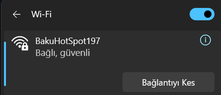
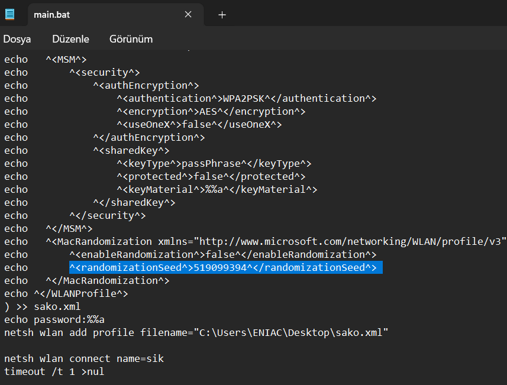

# Wifi Brute Force Repository

Bu repozitor, belirli bir WiFi ağının şifresini brute force yöntemiyle kırmak için kullanılan bir araçtır. Aşağıdaki adımları takip ederek kullanabilirsiniz.

## Gereksinimler

- Windows işletim sistemi
- Internet bağlantısı (ilk bağlantıyı kesmeniz gerekecek)

## Dosyalar

- **main.bat**: Brute force işlemini gerçekleştiren ana betik.
- **key.txt**: Denenecek şifrelerin listesi.

## Kullanım Talimatları

1. **ZIP Dosyasını İndirip Açın**  
   Bu repoyu ZIP dosyası olarak indirin ve bilgisayarınızdaki `Desktop` klasörüne çıkarın.

    
2. **İnternet Bağlantısını Kesin**  
   Brute force işlemini gerçekleştirmeden önce bağlı olduğunuz internet bağlantısını kesmelisiniz. 

     
   

3. **SSID Değişikliği**  
   `main.bat` dosyasını açın ve brute force etmek istediğiniz WiFi ağının SSID’sini değiştirdiğinizden emin olun.
   
   
5. **Rasgele Rakam Değişikliği**  
   Aşağıdaki satırdaki rasgele bir rakamı seçin ve onun yerine başka bir rakam yazın. Bu işlemi her çalıştırmadan önce yapmalısınız.
     
   ```xml
   <randomizationSeed>519099394</randomizationSeed>
   ```

6. **Brute Force İşlemini Başlatma**  
   Her şey hazır olduğunda, antivirus programlarını bir müddetlik dayandırın sonra `main.bat` dosyasını tıkla ve brute force işlemini başlatın. 

## Uyarılar

- Bu aracı yalnızca izinli ağlarda kullanın. İzin almadan bir ağa saldırmak yasalara aykırıdır.
- Kullanıcıların güvenliğini ve gizliliğini ihlal etmeyin.

